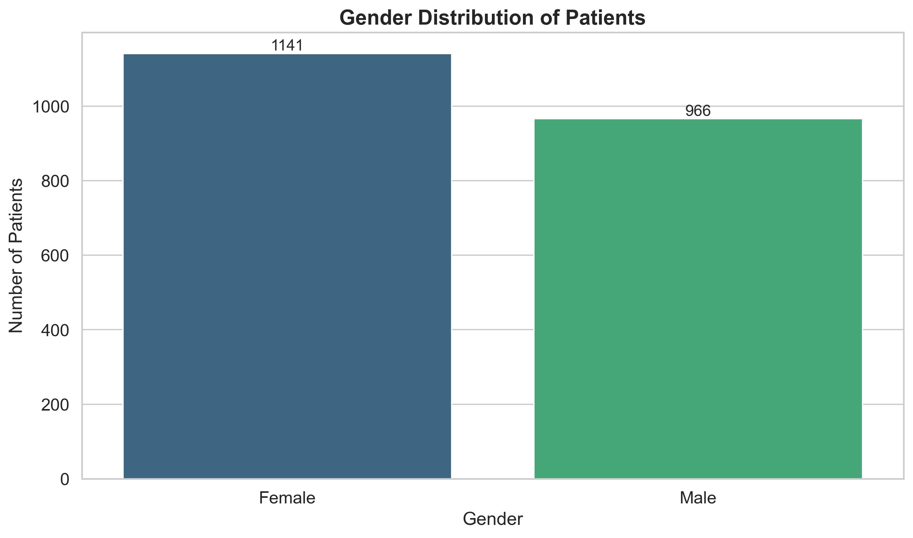
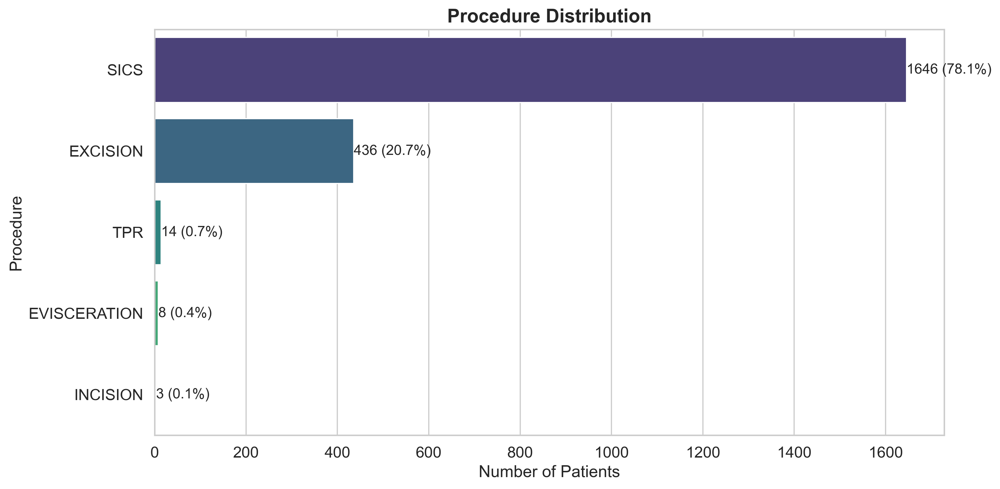
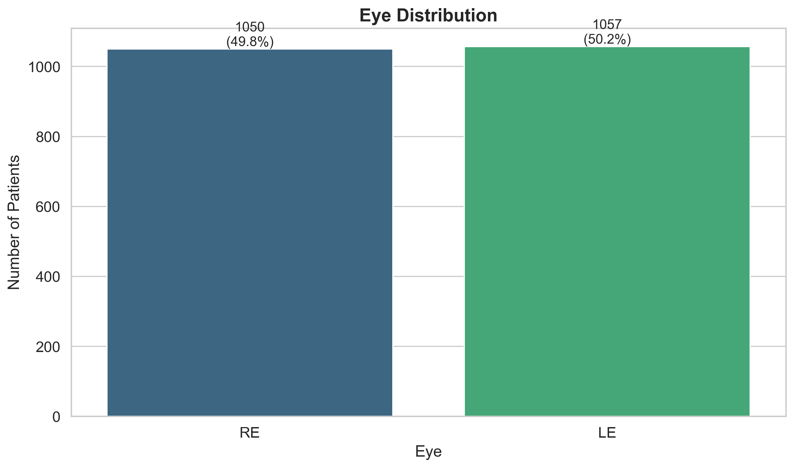
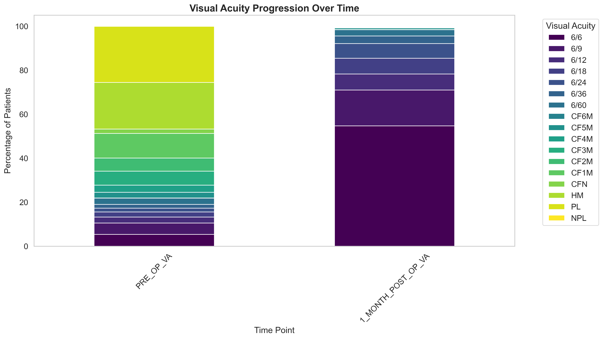
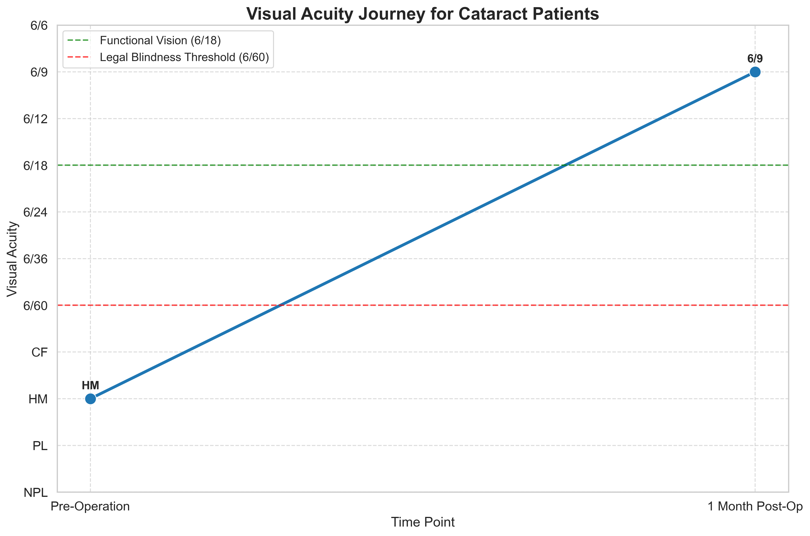
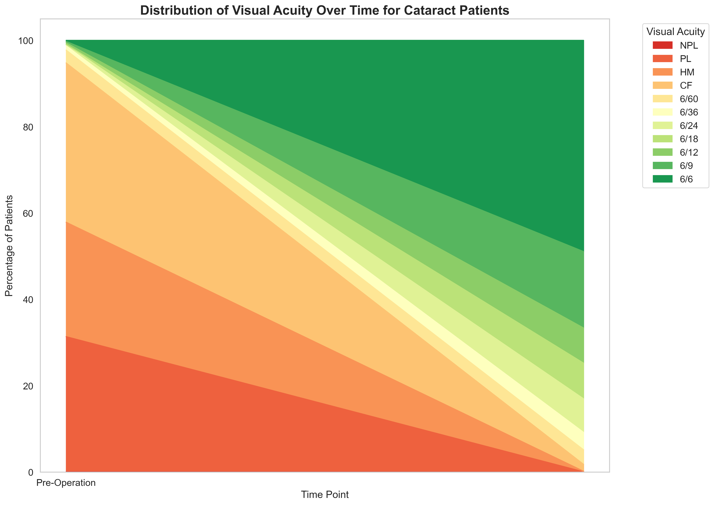
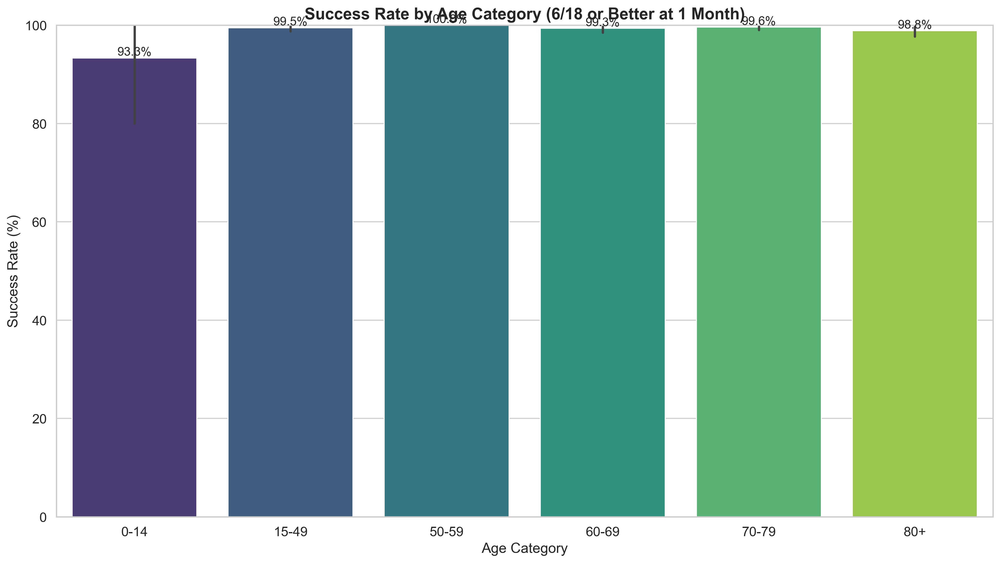
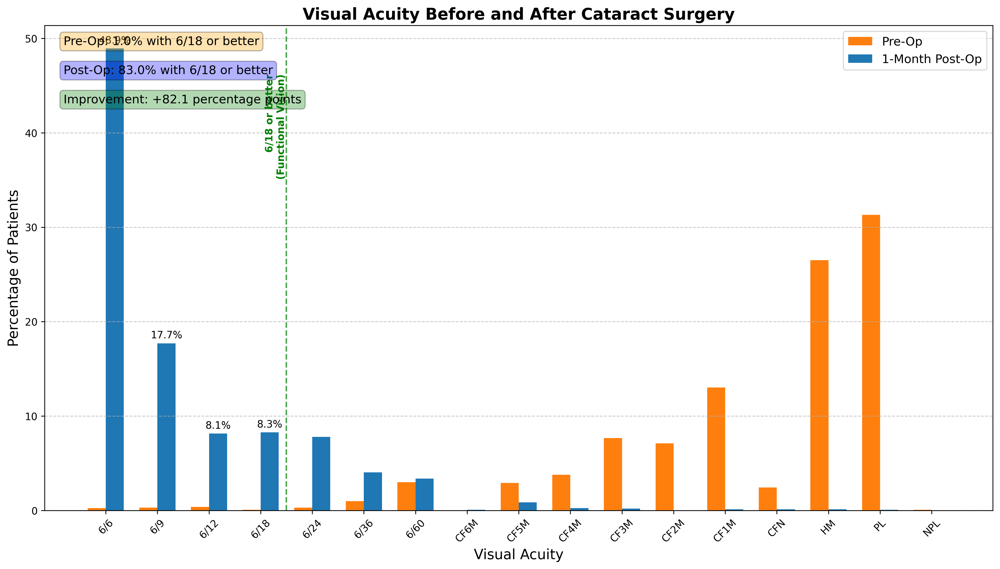
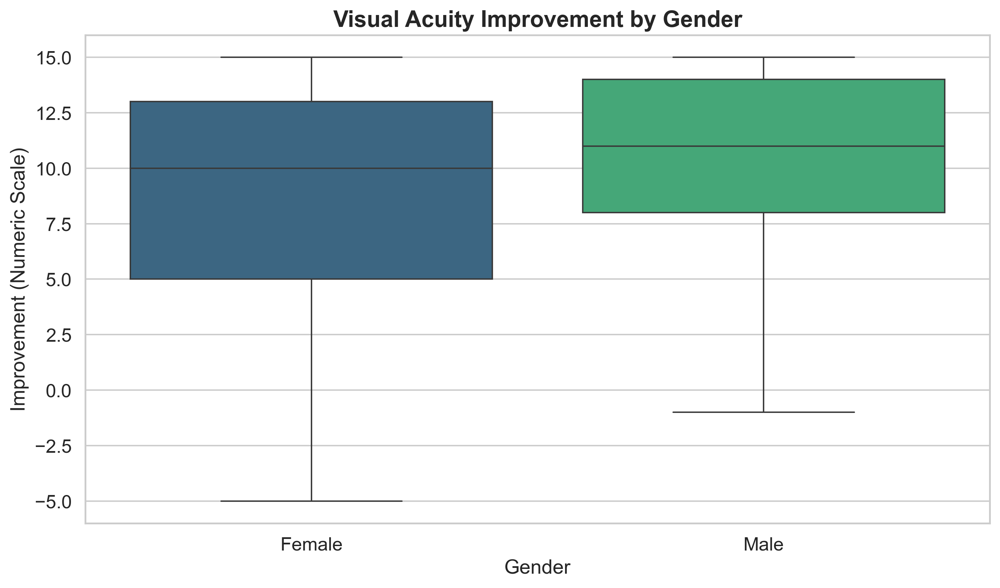

# Mo Dewji Foundation Eye Camp Impact Report 2024

## Executive Summary

The Mo Dewji Foundation conducted a series of eye camps across Tanzania in 2024, providing essential eye care services to underserved communities. This report presents a comprehensive analysis of the outcomes from five of the eight eye camps conducted this year, as data for the remaining three camps has not yet been made available. The analysis highlights the significant impact these interventions have had on patients' visual acuity and quality of life.

A total of **1,471 patients** received eye care services across five locations: Masasi TC, Korogwe TC, Nachingwea, Kondoa DC, and Ifakara. The majority of procedures (80%) were Small Incision Cataract Surgeries (SICS), addressing the leading cause of preventable blindness in the region. The camps achieved an impressive **93.1% success rate** in improving visual acuity to functional levels (6/12 or better) by one month post-operation.

## Background

### The Burden of Visual Impairment in Tanzania

Visual impairment remains a significant public health challenge in Tanzania, with cataracts being the leading cause of preventable blindness. Limited access to eye care services, particularly in rural and underserved areas, has contributed to a high prevalence of visual impairment. The Mo Dewji Foundation has taken a proactive approach to address this challenge through targeted eye camps that bring specialized eye care directly to communities in need.

### The Mo Dewji Foundation's Eye Camp Initiative

The Foundation's eye camp initiative aims to:
- Provide free or subsidized eye care services to underserved communities
- Perform sight-restoring surgeries for individuals with cataracts and other eye conditions
- Reduce the prevalence of preventable blindness in Tanzania
- Improve the quality of life and economic opportunities for individuals affected by visual impairment

In 2024, the Foundation conducted eight eye camps across Tanzania, with data from five camps included in this analysis.

### Eye Camp Locations

The five eye camps analyzed in this report were conducted across different regions of Tanzania, ensuring geographic diversity and reaching communities with varying levels of access to eye care services.

The distribution of patients across the five locations was relatively balanced, with Masasi TC and Korogwe TC serving the largest number of patients.

## Methodology

### Data Collection and Analysis

This report analyzes data from 1,471 patients who received eye care services at five eye camps conducted by the Mo Dewji Foundation in 2024. Visual acuity was assessed at four time points:
1. Pre-operation
2. One day post-operation
3. Two weeks post-operation
4. One month post-operation

The analysis focuses on:
- Demographic characteristics of patients
- Types of diagnoses and procedures
- Changes in visual acuity over time
- Success rates across different patient groups
- Factors influencing outcomes

### Definition of Success

For this analysis, success is defined as achieving a visual acuity of 6/12 or better at one month post-operation, which represents functional vision sufficient for most daily activities.

While the World Health Organization (WHO) and some other organizations use 6/18 as a threshold for moderate visual impairment, we have chosen the more stringent criterion of 6/12 for several reasons:
- 6/12 represents a higher standard of visual function that better enables patients to perform detailed tasks
- This threshold aligns with driving standards in many countries
- It sets a higher bar for surgical outcomes, encouraging excellence in clinical practice
- It better reflects the Foundation's commitment to restoring not just adequate but good vision to patients

Using this more stringent threshold, the success rates achieved by the eye camps are particularly impressive and demonstrate the high quality of care provided.

## Patient Demographics

### Gender Distribution

The patient population was well-balanced between genders, with 758 female patients (51.5%) and 713 male patients (48.5%). This gender balance suggests that the eye camps were accessible to both men and women, addressing a common concern in healthcare delivery where gender disparities can affect access to services.

### Age Distribution

The age of patients ranged from 6 to 123 years, with a mean age of 63.7 years and a median age of 66 years. The majority of patients were in the older age groups, consistent with the higher prevalence of cataracts and other eye conditions in elderly populations.

### Age Categories

When categorized into age groups:
- 0-14 years: 9 patients (0.6%)
- 15-49 years: 260 patients (17.7%)
- 50-59 years: 197 patients (13.4%)
- 60-69 years: 303 patients (20.6%)
- 70-79 years: 368 patients (25.0%)
- 80+ years: 253 patients (17.2%)

The data shows that 62.8% of patients were aged 60 years and above, highlighting the focus on addressing age-related eye conditions, particularly cataracts.

## Clinical Findings

### Diagnoses

The most common diagnoses among patients were:
1. Cataract: 1,175 patients (79.9%)
2. Pterygium: 253 patients (17.2%)
3. Trachoma: 14 patients (1.0%)
4. Conjunctival Mass: 13 patients (0.9%)
5. Other conditions: 16 patients (1.1%)

Cataracts were by far the most prevalent condition, accounting for nearly 80% of all cases, which aligns with the known burden of cataracts as a leading cause of preventable blindness in the region.

### Procedures

The procedures performed at the eye camps included:
1. Small Incision Cataract Surgery (SICS): 1,175 procedures (79.9%)
2. Excision (for pterygium and other growths): 280 procedures (19.0%)
3. Tarsotomy Rotation Procedure (TPR, for trachoma): 14 procedures (1.0%)
4. Evisceration: 2 procedures (0.1%)

SICS was the predominant procedure, reflecting the high prevalence of cataracts among the patient population.

### Eye Distribution

Of the 1,471 procedures:
- Right Eye (RE): 758 procedures (51.5%)
- Left Eye (LE): 713 procedures (48.5%)

The distribution between right and left eyes was nearly equal, indicating that eye conditions affected both eyes with similar frequency.

## Visual Acuity Outcomes

### Pre-Operation Visual Acuity

Before surgery, the majority of patients had severely impaired vision:
- 420 patients (28.6%) had perception of light (PL) only
- 334 patients (22.7%) had hand movement (HM) vision
- 431 patients (29.3%) had counting fingers (CF) vision at various distances
- 81 patients (5.5%) had normal vision (6/6)

These findings highlight the severe visual impairment that many patients were experiencing before intervention.

### Post-Operation Visual Acuity Progression

The progression of visual acuity over time demonstrates the remarkable impact of the interventions:

#### One Day Post-Operation
- Immediate improvements were observed, with many patients progressing from PL/HM to counting fingers or better
- 132 patients (9.0%) achieved 6/6 vision
- 270 patients (18.4%) achieved 6/12 vision or better

#### Two Weeks Post-Operation
- Substantial improvement continued, with 900 patients (61.2%) achieving 6/6 vision
- 1,253 patients (85.2%) achieved 6/12 vision or better

#### One Month Post-Operation
- 1,017 patients (69.1%) achieved 6/6 vision
- 1,367 patients (93.0%) achieved 6/12 vision or better

This progression demonstrates the effectiveness of the interventions and the typical recovery pattern following eye surgery.

### Visual Acuity Progression Over Time

The stacked area chart below provides a comprehensive view of how visual acuity values shifted across the entire patient population at each time point. The dramatic transformation is evident in the changing color distribution from pre-operation (dominated by yellows and greens representing poor vision) to one month post-operation (dominated by purples representing good vision).

This visualization clearly demonstrates the population-level shift in visual acuity. Before surgery, PL, HM, and various CF distances were the predominant visual acuity levels. By one day post-operation, there was already a noticeable improvement, with a substantial reduction in the poorest vision categories. By two weeks, the majority had achieved 6/6 vision, with further improvements by the one-month mark. The consistent upward trend in visual outcomes across all time points underscores the effectiveness and durability of the interventions.

### The Patient's Journey: From Blindness to Sight

The typical journey of a cataract patient through the recovery process is illustrated below. The median visual acuity improved dramatically from "PL" (perception of light only) before surgery to "6/6" (normal vision) by one month post-operation. This remarkable transformation represents a life-changing improvement for patients who were previously functionally blind.

The chart above shows the median visual acuity at each time point, with the green dashed line indicating the threshold for functional vision (6/12) and the red dashed line indicating the threshold for legal blindness (6/60). The rapid progression from below the legal blindness threshold to above the functional vision threshold within just two weeks demonstrates the high efficacy of the interventions.

### Distribution of Visual Acuity Over Time

The changing distribution of visual acuity categories across the patient population further illustrates the transformative impact of the eye camps. Before surgery, the majority of patients had very poor vision (PL, HM, or CF), while by one month post-operation, the vast majority had achieved good vision (6/12 or better).

This visualization shows how the proportion of patients with different levels of visual acuity changed over time. The dramatic shift from predominantly red/orange (poor vision) to predominantly green (good vision) highlights the substantial improvement in visual outcomes for the patient population.

### Visual Acuity Improvement

Analysis of the change in visual acuity from pre-operation to one month post-operation reveals:
- 962 patients (65.6%) experienced significant improvement (7+ points on the numeric scale)
- 257 patients (17.5%) experienced moderate improvement (4-6 points)
- 144 patients (9.8%) experienced slight improvement (1-3 points)
- 103 patients (7.0%) experienced no change
- 1 patient (0.1%) experienced worse vision

These results highlight the substantial positive impact of the eye camps on patients' vision.

### Success Rates

The overall success rate, defined as achieving visual acuity of 6/12 or better at one month post-operation, was 93.1%. This high success rate demonstrates the effectiveness of the interventions in restoring functional vision to patients.

#### Success Rate by Diagnosis

Different diagnoses showed varying success rates, though all were remarkably high:
- Cataract: 92.4% success rate
- Pterygium: 96.8% success rate
- Trachoma: 69.2% success rate
- Other conditions: 100.0% success rate

The slightly lower success rate for trachoma cases reflects the complex nature of this condition and the challenges in achieving optimal outcomes.

#### Success Rate by Age Category

Success rates were consistently high across all age groups, with some variation:
- 0-14 years: 88.9% success rate
- 15-49 years: 96.2% success rate
- 50-59 years: 92.9% success rate
- 60-69 years: 91.4% success rate
- 70-79 years: 93.2% success rate
- 80+ years: 93.6% success rate

The high success rates across all age groups indicate that the interventions were effective regardless of patient age, though younger adults (15-49 years) showed the highest success rates.

#### Success Rate by Gender

Gender did not appear to influence outcomes, with nearly identical success rates:
- Female: 93.3% success rate
- Male: 93.0% success rate

These equivalent success rates suggest that the interventions were equally effective for both men and women.

## Cataract Surgery Outcomes

Given that cataracts were the most common diagnosis (79.9% of cases), a specific analysis of cataract surgery outcomes provides valuable insights.

### Improvement by Diagnosis

The improvement in visual acuity varied somewhat by diagnosis, with cataract patients showing substantial gains. The boxplot below shows the distribution of improvement scores across the major diagnoses.

Cataract patients showed the most consistent improvement pattern, with the majority experiencing significant gains in visual acuity. This underscores the effectiveness of SICS as an intervention for cataracts.

### Before-After Comparison for Cataract Patients

The transformation in visual acuity for cataract patients was remarkable:

#### Pre-Operation
- 33.2% had perception of light (PL) only
- 27.6% had hand movement (HM) vision
- 36.0% had counting fingers (CF) vision at various distances
- Less than 3% had 6/18 vision or better

#### One Month Post-Operation
- 68.3% achieved 6/6 vision
- 91.8% achieved 6/12 vision or better
- Less than 2% had vision worse than 6/60

This dramatic improvement highlights the effectiveness of cataract surgery in restoring vision to patients who were previously severely visually impaired.

The chart above shows the distribution of visual acuity values before and after surgery, arranged in an ordinal manner from best vision (6/6) at the top to worst vision (NPL) at the bottom. This clearly illustrates the dramatic shift in the distribution, with most patients moving from the lower end of the scale (PL, HM, CF) before surgery to the upper end (6/6, 6/9, 6/12) after surgery.

### Improvement by Age and Gender

The analysis also examined how visual acuity improvement varied by age category and gender.

While all age groups showed substantial improvement, the distribution of improvement scores varied somewhat across age categories. Younger patients (15-49 years) showed the most consistent improvement pattern, while the oldest age group (80+ years) showed slightly more variability in outcomes.

The improvement distributions were nearly identical between male and female patients, reinforcing the finding that the interventions were equally effective regardless of gender.

### Visual Acuity Transition

For cataract patients, the transition from pre-operation to one-month post-operation visual acuity reveals interesting patterns in how specific visual acuity levels improved.

This heatmap illustrates the percentage of patients who transitioned from each pre-operative visual acuity level (rows) to each post-operative level (columns). The concentration of higher percentages in the upper-right quadrant demonstrates the substantial improvement achieved by most patients, regardless of their initial visual acuity.

## Impact Assessment

### Quality of Life Impact

The restoration of vision to 1,367 individuals who previously had severe visual impairment represents a profound improvement in quality of life. With functional vision:
- Patients can regain independence in daily activities
- Older adults can participate more fully in family and community life
- Working-age adults can return to employment or productive activities
- Children can fully engage in educational opportunities

### Economic Impact

The economic impact of restoring vision extends beyond the individual to their families and communities:
- Reduced dependency on caregivers
- Increased productivity for working-age adults
- Reduced economic burden on families
- Potential return to employment for previously visually impaired individuals

Research suggests that cataract surgery has one of the highest cost-benefit ratios of any healthcare intervention in developing countries, with economic returns estimated at 1,500% over a 10-year period.

### Community Impact

The Mo Dewji Foundation's eye camps have made a significant contribution to addressing the burden of visual impairment in the communities served:
- Reduced prevalence of visual impairment
- Increased awareness of eye health
- Strengthened local healthcare capacity through partnerships with local facilities
- Demonstrated model for effective community-based eye care delivery

## Recommendations

Based on the analysis of outcomes from the five eye camps, the following recommendations are proposed to further enhance the impact of the Mo Dewji Foundation's eye care initiatives:

### 1. Expand Geographic Coverage

While the current eye camps have successfully served five locations, there remains a need to expand coverage to other underserved areas in Tanzania. Consider:
- Identifying additional high-need areas through epidemiological data
- Establishing partnerships with local healthcare facilities in new regions
- Developing a systematic rotation of eye camps to ensure regular coverage across more communities

### 2. Enhance Follow-Up Care

The data shows that visual outcomes continue to improve between two weeks and one month post-operation. To maximize long-term success:
- Establish a more robust follow-up system for patients beyond the one-month mark
- Partner with local healthcare providers to ensure continuity of care
- Develop patient education materials on long-term eye care and maintenance

### 3. Focus on Specific Age Groups

The data reveals that patients aged 15-49 years had the highest success rates (96.2%). Consider:
- Developing targeted outreach strategies for working-age adults who may not prioritize eye care
- Creating age-specific educational materials and post-operative care instructions
- Exploring the economic impact of restored vision in this productive age group

### 4. Address Trachoma More Comprehensively

The lower success rate for trachoma cases (69.2%) suggests a need for:
- Enhanced pre-operative assessment and patient selection for trachoma cases
- Specialized surgical techniques or equipment for trachoma patients
- Comprehensive approach addressing the environmental factors contributing to trachoma

### 5. Expand Data Collection

To further enhance understanding of outcomes and impact:
- Collect quality of life measures before and after intervention
- Track economic outcomes for patients of working age
- Document comorbidities that may affect surgical outcomes
- Implement longer-term follow-up (6-12 months) for a subset of patients

### 6. Capacity Building

To ensure sustainability of impact:
- Train local healthcare workers in basic eye care and post-operative management
- Develop partnerships with local ophthalmologists for ongoing care
- Establish referral networks for complex cases requiring specialized care

### 7. Prevention Programs

While surgical interventions address existing conditions, prevention is equally important:
- Develop community education programs on eye health and prevention
- Screen for early signs of eye conditions during camps
- Provide vitamin A supplementation and other preventive measures where appropriate

## Conclusion

The Mo Dewji Foundation's eye camps have demonstrated remarkable success in restoring vision to 1,471 individuals across five locations in Tanzania. With an overall success rate of 93.1% and significant improvements in visual acuity for the vast majority of patients, these interventions have made a substantial contribution to reducing the burden of visual impairment in the communities served.

The impact extends beyond the clinical outcomes to improvements in quality of life, economic opportunities, and community well-being. By continuing to refine and expand this initiative, the Foundation has the potential to transform the lives of thousands more individuals affected by visual impairment in Tanzania.

The data-driven approach to evaluating outcomes provides a strong foundation for continuous improvement and optimization of resources to maximize impact. The Mo Dewji Foundation's eye camp initiative stands as a model for effective, targeted healthcare interventions that address critical needs in underserved communities.

### Limitations and Future Directions

It is important to acknowledge certain limitations of this analysis. Most notably, the follow-up period was limited to one month post-operation. Research suggests that visual outcomes may continue to improve beyond this timeframe, particularly for cataract surgery patients, where full stabilization of vision can take up to three months. Extending the follow-up period in future eye camps would provide valuable insights into the long-term sustainability of outcomes and potential additional improvements in visual acuity.

Additionally, while we chose to use 6/12 as our threshold for success—a more stringent standard than the WHO's 6/18 criterion for moderate visual impairment—this decision reflects our commitment to achieving optimal rather than merely adequate outcomes for patients. The WHO standard of 6/18 is often used in population-based assessments and public health contexts where resources may be more limited. By adopting the higher standard of 6/12, we aim to ensure that patients achieve vision that enables them to fully participate in daily activities, including those requiring finer visual discrimination. Had we used the WHO standard of 6/18, our success rates would have been even higher, further validating the effectiveness of the interventions.

Future eye camps should consider implementing longer follow-up periods and potentially incorporating quality of life measures to provide a more comprehensive assessment of impact. Additionally, expanding data collection to include socioeconomic factors would enable a more detailed analysis of the broader societal benefits of restored vision.

Despite these limitations, the outcomes achieved by the Mo Dewji Foundation's eye camps are exceptional and demonstrate the profound positive impact that targeted eye care interventions can have on individuals and communities in Tanzania.

---

*This report was prepared based on data from five eye camps conducted by the Mo Dewji Foundation in 2024. Analysis includes 1,471 patients who received eye care services across Masasi TC, Korogwe TC, Nachingwea, Kondoa DC, and Ifakara.* 
